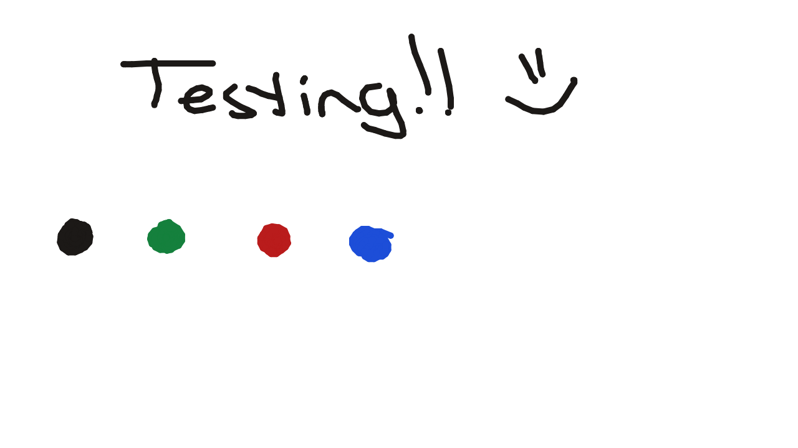

# Crafting Interpreters
Prerequisites: Mathematics/Calculus 1

## Introduction

This is a course on Interpreters, Compilers and everything underneath.

## Key Ideas

### Testing Smaller Titles

```c
printf("HELLO!");
- Add the core concepts
- Link to supporting material
- Include diagrams or equations when useful
```
[label](https://example.com)

$$
x^2 + y^2 = z^2
$$

