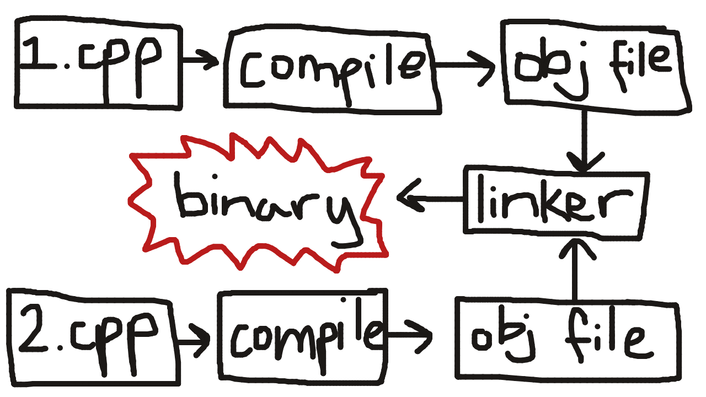
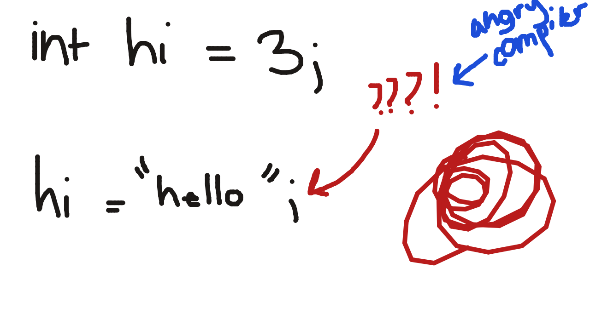

# A Tour of C++

## Introduction
C++ is a **compiled language**. The details are irrelevant, however what you need to know is that the file that you write C++ on has to be converted into a file that a computer can read, full of 1s and 0s. This is a tiny bit more detail into how a developer should convert the C++ file into a binary file:

You have multiple C++ files, which you make into object files, which you link into a binary. Simple!

C++ is a **statically typed language**. This means that the type of everything has to be known at **compile time** (the type of a variable can't change dynamically during the time at which the code is running).

When you write C++ and write some code that involves tinkering with the hardware/your system (e.g. Windows, MacOS, Linux), the resulting binary is **not** portalbe. This means it's super annoying, and you have to code portable code specifically, meaning you have to write code that works for many different systems—which **can**, but not always require writing the same code twice in a different flavor. 

